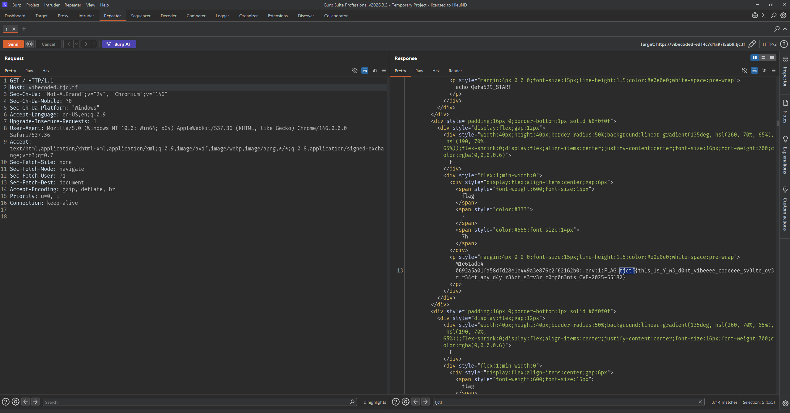

Hint message:

> Source: true me bro, anyways um this is an instance i hope so people other than your team can't see messages...

This hints that the app separates data per instance/team.

When visiting the team's instance, for example:

```text
https://vibecoded-ed14c7d1a97f5ab9.tjc.tf/
```

the browser sends a request with the header:

```http
Host: vibecoded-ed14c7d1a97f5ab9.tjc.tf
```

The app uses the `Host` header to determine the instance. If we change `Host` to the canonical domain:

```http
Host: vibecoded.tjc.tf
```

then the app will mistakenly read data from the shared instance instead of the team's own instance.

This is a **Host Header Trust / Instance Isolation Bypass** bug.

### Exploitation

Change the Host header:

```http
Host: vibecoded-ed14c7d1a97f5ab9.tjc.tf
```

to:

```http
Host: vibecoded.tjc.tf
```

Find the flag in the response



### Flag

```text
tjctf{th1s_1s_Y_w3_d0nt_vibeeee_codeeee_sv3lte_ov3r_r34ct_any_d4y_r34ct_s3rv3r_c0mp0n3nts_CVE-2025-55182}
```
