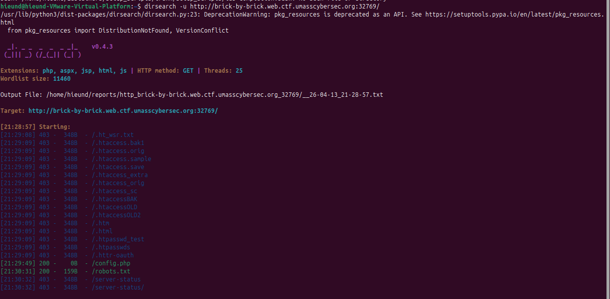
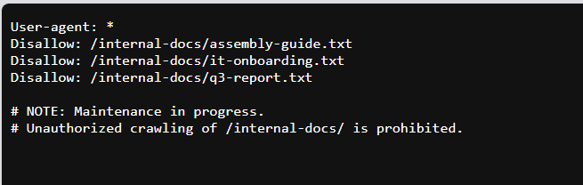
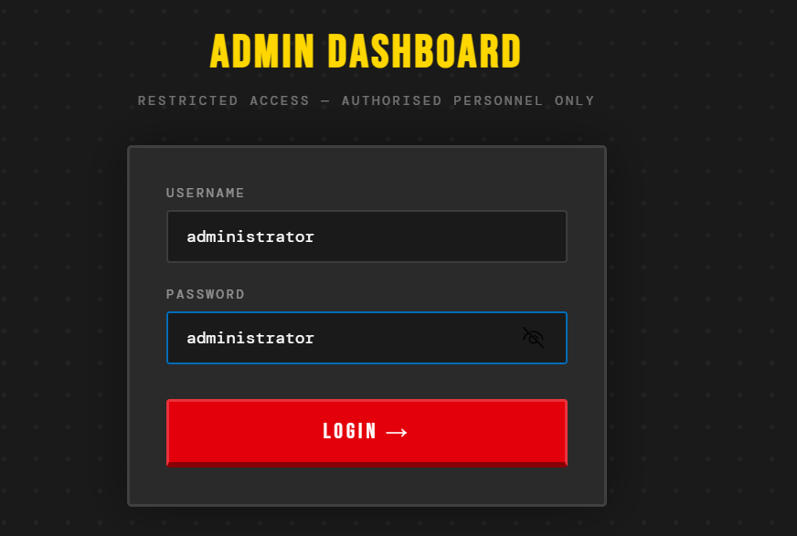
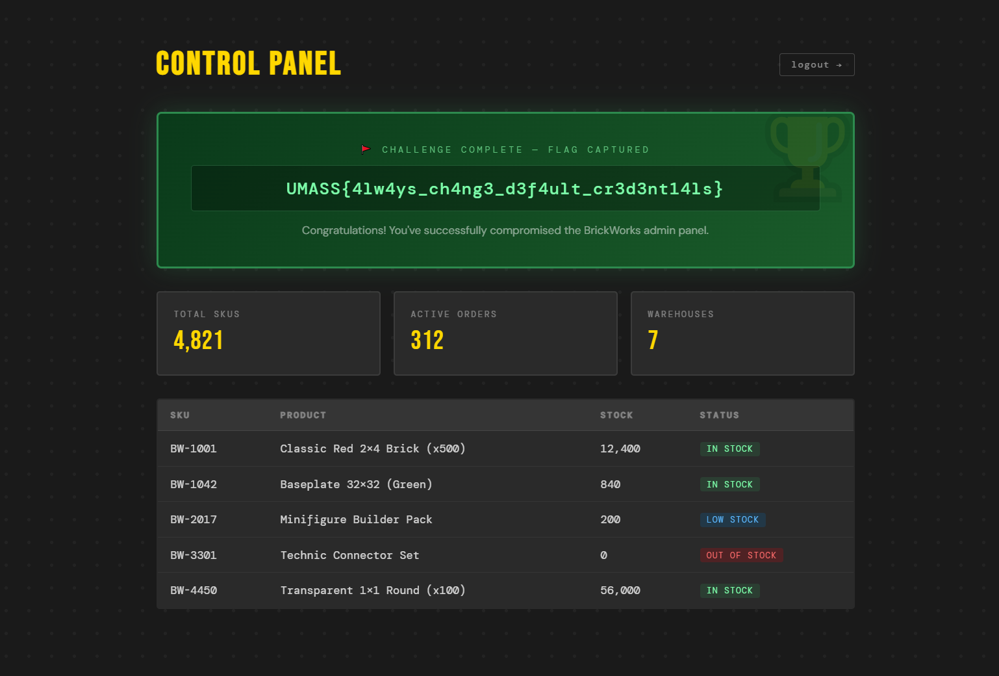

### Mô tả đề bài

Trang chủ của challenge chỉ hiển thị thông báo bảo trì:

> “Internal systems are currently undergoing maintenance.”

### Dò thư mục và tìm `robots.txt`

Dùng `dirsearch`:



Từ đây biết được có thư mục ẩn:



---

### Mở các file nội bộ

Truy cập lần lượt các file.

Nội dung đáng chú ý trong file `/internal-docs/it-onboarding.txt`:

```text
SECTION 1 - DOCUMENT PORTAL

The internal document portal lives at our main intranet address.
Staff can access any file using the ?file= parameter:

SECTION 2 - ADMIN DASHBOARD

Credentials are stored in the application config file
for reference by the IT team. See config.php in the web root.
```

Từ đây có 2 thông tin rất quan trọng:

1. Website có chức năng đọc file qua tham số `?file=`

2. Thông tin đăng nhập admin nằm trong `config.php`

Truy cập `/?file=config.php`:

```php
<?php
// BrickWorks Co. — Application Configuration
// WARNING: Do not expose this file publicly!

// The admin dashboard is located at /dashboard-admin.php.

// Database
define('DB_HOST', 'localhost');
define('DB_NAME', 'brickworks');
define('DB_USER', 'brickworks_app');
define('DB_PASS', 'Br1ckW0rks_db_2024!');

// WARNING: SYSTEM IS CURRENTLY USING DEFAULT FACTORY CREDENTIALS.
// TODO: Change 'administrator' account from default password.

define('ADMIN_USER', 'administrator');
define('ADMIN_PASS', '[deleted it for safety reasons - Tom]');

// App settings
define('APP_ENV', 'production');
define('APP_DEBUG', false);
define('APP_VERSION', '1.0.3');
```

Ta lấy được:

- đường dẫn dashboard admin:

```text
/dashboard-admin.php
```

- username admin:

```text
administrator
```

- password thật đã bị xóa:

```php
define('ADMIN_PASS', '[deleted it for safety reasons - Tom]');
```

- và một comment rất quan trọng:

```php
// WARNING: SYSTEM IS CURRENTLY USING DEFAULT FACTORY CREDENTIALS.
// TODO: Change 'administrator' account from default password.
```

Câu này cho biết hệ thống vẫn đang dùng mật khẩu mặc định

```text
administrator
```

Truy cập `/dashboard-admin.php`:





Flag

- `UMASS{4lw4ys_ch4ng3_d3f4ult_cr3d3nt14ls}`