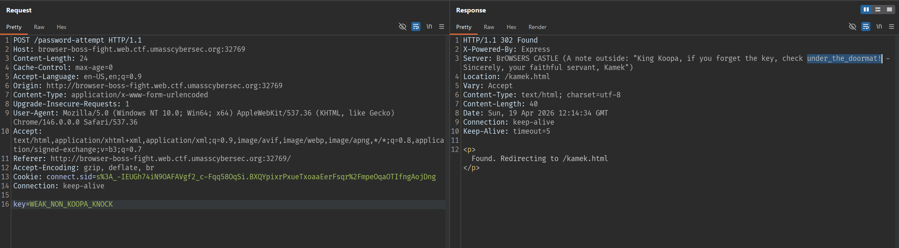
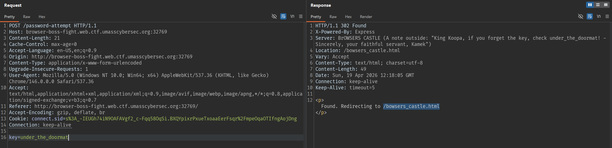
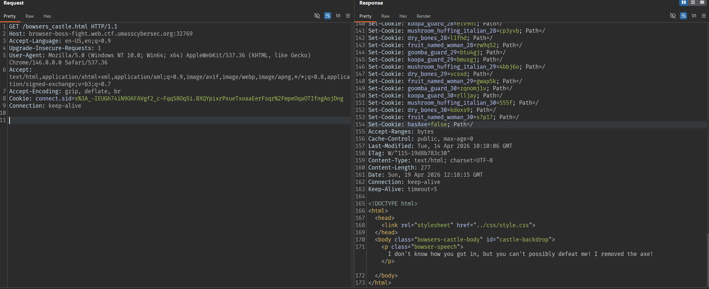

### Overview

When visiting the challenge website, we see an interface with a **key** input field and a **door** that can be clicked. The initial idea is to try entering a key and observe how the application handles it.

### Inspecting the client-side source code

After viewing the page source, we can see the value the user enters is not kept as-is. Instead, the key is always replaced with the string:

```text
WEAK_NON_KOOPA_KNOCK
```

This shows that entering a random key in the UI is just a layer of misdirection.

### Observing the server response

In the response, there is a fairly notable header, Server, and here a hint appears:

```text
under_the_doormate
```


### Trying the key from the hint

We use the value `under_the_doormate` as the key to send a request.



This time the response gives us a new endpoint; accessing that endpoint we get:


### Cookie analysis

Observing the browser cookies, we see a variable named:

```text
hasAxe=false
```



This variable name hints that the system is checking whether the player has an “axe” or not. Since the challenge is about opening a door, the server very likely only lets you proceed if this cookie has the correct value.

### Modifying the cookie

We change the cookie from:

```text
hasAxe=false
```

to:

```text
hasAxe=true
```

Then access the endpoint corresponding to the correct key again.

The server returns the flag:


### Flag

```text
UMASS{br0k3n_1n_2_b0wz3r5_c4st13}
```
