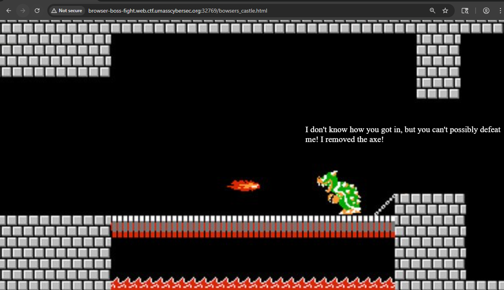
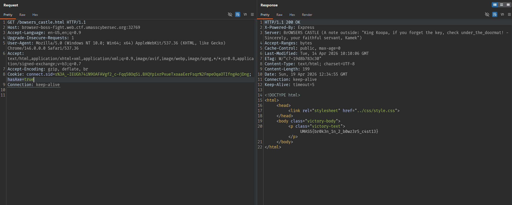

# BrOWSER BOSS FIGHT

## Overview

Khi truy cập website của bài, ta thấy giao diện gồm một ô nhập **key** và một **cánh cửa** có thể bấm vào. Ý tưởng ban đầu là thử nhập key và quan sát ứng dụng xử lý như thế nào.

## Kiểm tra source code phía client

Sau khi xem source code của trang, có thể thấy giá trị người dùng nhập vào không được giữ nguyên. Thay vào đó, key luôn bị thay thế bằng chuỗi:

```text
WEAK_NON_KOOPA_KNOCK
```

Điều này cho thấy việc nhập key ngẫu nhiên ở giao diện chỉ là một lớp đánh lạc hướng.

## Quan sát phản hồi từ server

Trong response, có một header khá đáng chú ý là Server, và tại đây xuất hiện gợi ý:

```text
under_the_doormate
```


## Thử dùng key theo gợi ý

Ta dùng giá trị `under_the_doormate` làm key để gửi request.


Lần này response trả về cho ta 1 endpoint mới, truy cập endpoint đó ta được:



## Phân tích cookie

Quan sát cookie của trình duyệt, ta thấy có một biến tên là:

```text
hasAxe=false
```


Tên biến này gợi ý rằng hệ thống đang kiểm tra xem người chơi có “rìu” hay không. Vì challenge liên quan đến mở cửa, rất có thể server sẽ chỉ cho đi tiếp nếu cookie này mang giá trị đúng.

## Chỉnh sửa cookie

Ta sửa cookie từ:

```text
hasAxe=false
```

thành:

```text
hasAxe=true
```

Sau đó truy cập lại endpoint tương ứng với key đúng.

Server trả về flag:



## Flag

```text
UMASS{br0k3n_1n_2_b0wz3r5_c4st13}
```
